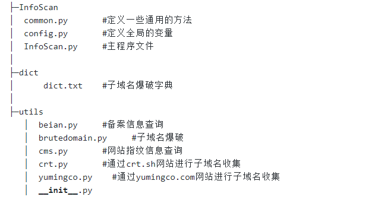
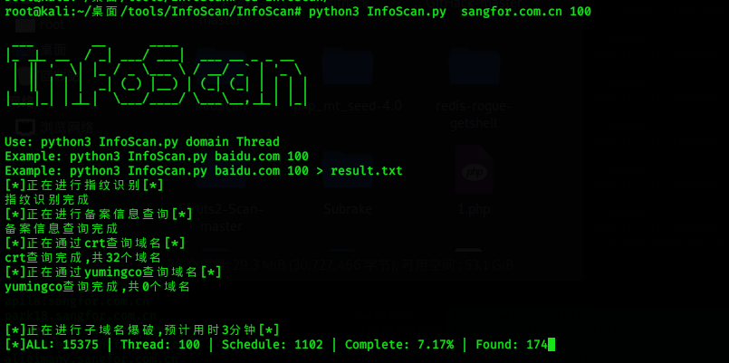
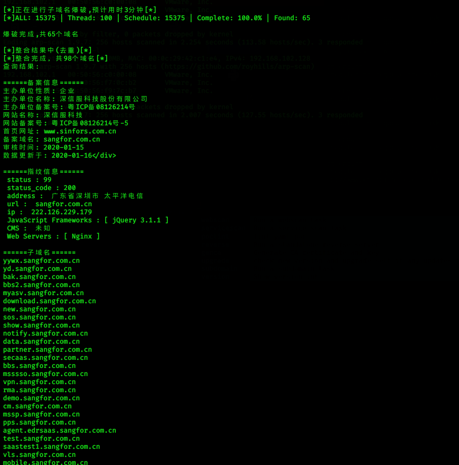
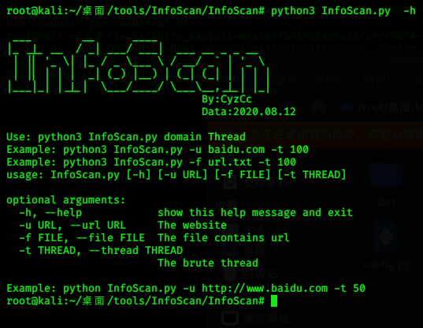

# 2020.8.15
## InfoScan
一个可进行备案信息查询，指纹信息查询，子域名爆破的工具
可自己在utils文件夹下添加其他模块

## 文件结构

## 使用方法
python3 InfoScan.py 域名  线程

## 效果截图

# 2020.10.09
**增加了更多查询接口，精简代码**
## crt查询结果
   yumingco查询
   ip138查询
   hackertarget查询
   virustotal查询
   Cesuyun查询

# 2020.10.13
## 增加命令行参数

## 增加批量查询子域名和批量爆破子域名功能

